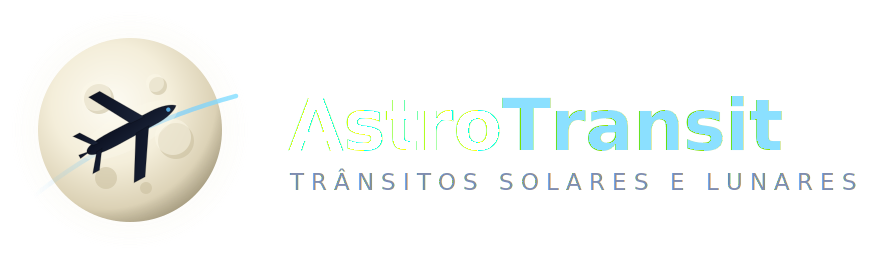

<div align="center">
  
</div>

# AstroTransit

Rastreamento e **previsão de trânsitos de aeronaves** diante do Sol e da Lua, a partir
da posição exata do observador. O app identifica aviões próximos, projeta suas
trajetórias e calcula quando um deles poderá cruzar visualmente o disco solar ou lunar
— informando *qual* astro, *em quanto tempo*, *para onde apontar* e com *qual confiança*.

> Voltado a astrofotógrafos, fotógrafos de aviação e observadores do céu.

## Arquitetura

```
Flutter App  ──HTTPS/WebSocket──►  FastAPI Backend
                                     ├── astronomia (Skyfield)
                                     ├── provedores ADS-B (OpenSky / ADSB.lol / ...)
                                     ├── motor de previsão de trânsito
                                     └── motor de confiança
```

- **Backend:** Python · FastAPI · Skyfield · NumPy — cálculos pesados, proteção de
  chaves, normalização de provedores, cache.
- **Frontend:** Flutter · Dart · Riverpod — UI, radar, mapa, câmera e projeção local
  para manter a contagem regressiva fluida entre atualizações.

Consulte a [SPEC completa](docs/SPEC.md) para requisitos, roadmap e decisões.

## Status por etapa

| Fase | Descrição | Status |
|------|-----------|--------|
| Logo / identidade | Ícone + marca + paleta | ✅ |
| 1 — Núcleo matemático | Posição solar/lunar, ECEF/ENU, projeção, separação angular, trânsito | ✅ (33 testes) |
| 2 — Backend | Provedores ADS-B, cache, previsão, confiança, WebSocket | ✅ (53 testes) |
| 3 — Flutter MVP | Onboarding, localização, radar, previsão, contagem, histórico | ✅ (validado no emulador Android) |
| 4 — Mapa e faixa | Faixa geográfica, linha central, deslocamento | ⬜ |
| 5 — Câmera | Preview, overlay, calibração, gravação | ⬜ |

## Backend — desenvolvimento

```bash
cd backend
python -m venv .venv
.venv/Scripts/activate         # Windows
pip install -e ".[dev]"
pytest                          # roda toda a suíte (núcleo + API)
uvicorn app.main:app --reload   # sobe o servidor em http://127.0.0.1:8000
```

O núcleo matemático (`app/geometry`, `app/prediction`, `app/astronomy`) é **puro e
testável offline** — a única dependência externa é a efeméride JPL `de421.bsp`, baixada
uma vez e mantida localmente em `app/astronomy/_data/`.

## Núcleo matemático — módulos

| Módulo | Responsabilidade | SPEC |
|--------|------------------|------|
| `geometry/coordinates.py` | Geodésico → ECEF → ENU → azimute/altitude/distância | RF-008 |
| `geometry/angles.py` | Vetores unitários, separação angular, raio/tamanho aparente | RF-009/010/011 |
| `prediction/projection.py` | Projeção de trajetória (velocidade constante) | RF-007 |
| `prediction/transit.py` | Detecção de trânsito + refinamento temporal | RF-012/013 |
| `astronomy/ephemeris.py` | Posição aparente do Sol/Lua (Skyfield) | RF-003 |

## Backend — camadas da API

| Módulo | Responsabilidade | SPEC |
|--------|------------------|------|
| `providers/base.py`, `adsblol.py`, `opensky.py` | Provedores ADS-B normalizados | RF-004/005 |
| `providers/registry.py` | Cache + failover entre provedores | RF-006 |
| `confidence/scoring.py` | Pontuação de confiança 0-100 com fatores | RF-016 |
| `services/prediction_service.py` | Orquestra pré-filtro → candidatos → confiança | seção 10 |
| `api/v1/*.py` | `GET /v1/astronomy/position`, `GET /v1/aircraft/nearby`, `POST /v1/transits/predict`, `WS /v1/transits/live` | seção 14 |

## App Flutter (MVP)

```bash
cd app
flutter pub get
flutter run                 # requer o backend rodando (10.0.2.2:8000 no emulador Android)
flutter test
flutter analyze
```

| Tela | Responsabilidade | SPEC |
|------|------------------|------|
| `onboarding/` | 4 passos: boas-vindas, localização, notificações, aviso de segurança solar | seção 16.7 / RF-017 |
| `dashboard/` | Próxima oportunidade ou estado "sem trânsito", status de GPS | seção 16.2/16.3 |
| `radar/` | Sol/Lua/aeronaves plotados por azimute/altitude via `CustomPainter` | RF-020 |
| `live_tracking/` | Contagem regressiva ao vivo via WebSocket, UI reduzida nos segundos finais | RF-018, seção 16.5/16.6 |
| `history/` | Histórico local persistido (SharedPreferences) | RF-028 |
| `settings/` | Tema (escuro/claro/vermelho), astros monitorados, raio de busca | RF-002/004, seção 15.2 |

Estado gerenciado com Riverpod (sem geração de código); navegação com go_router;
modelos compartilhados em `shared/models/` espelham os schemas do backend.

---

<sub>Feito com atenção às limitações reais do ADS-B: previsões são apresentadas como
oportunidades prováveis com nível de confiança, nunca como certezas.</sub>
